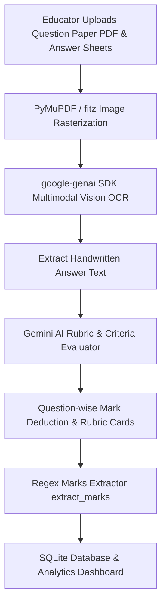

# 🎓 Bluebook Corrector — AI-Powered Handwritten Answer Sheet Evaluation System

[](https://ai-powered-handwritten-answer-sheet-52g1.onrender.com/)
[](https://www.python.org/)
[](https://flask.palletsprojects.com/)
[](https://ai.google.dev/)
[-purple.svg)](https://pymupdf.readthedocs.io/)
[](LICENSE)

🌐 **Live Web App**: [https://ai-powered-handwritten-answer-sheet-52g1.onrender.com/](https://ai-powered-handwritten-answer-sheet-52g1.onrender.com/)

**Bluebook Corrector** is a state-of-the-art web application that automates the grading of handwritten student answer sheets. Powered by **Google's official `google-genai` SDK** and **PyMuPDF**, it extracts handwritten answers, compares them against Question Paper reference content, and generates objective scores, detailed criteria breakdowns, and actionable feedback.

---

## 🌟 Key Features

- ⚡ **Official Google GenAI SDK (`google-genai`)**: Replaces HTTP REST calls with the official Python SDK using `types.Part.from_bytes` for native multimodal handwriting OCR.
- 🤖 **Auto-Detect Question Structure**: Automatically detects Question Numbers, Question Descriptions, Allocated Marks, and Total Exam Marks directly from uploaded Question Paper PDFs.
- 📄 **Pure Python PDF Processing**: Employs PyMuPDF (`fitz`) for $150\text{ DPI}$ image rasterization with **zero external binary dependencies** (no Poppler required).
- 🧮 **Interactive Question Marks Allocator**: Frontend builder allowing educators to configure question-wise mark allocations with live sum validation metrics (`Sum: 50 / 50 Marks`).
- 🖥️ **Split-Pane Evaluation Workspace**: Synchronized dual-pane workspace featuring tabbed views for Answer Sheets, Question Papers, and OCR Extracted Text paired with structured AI Feedback Cards.
- 🔄 **Intelligent Model Fallback & Retry**: Built-in exponential backoff retry and automatic model switching across `gemini-2.0-flash`, `gemini-2.5-flash`, and `gemini-2.0-flash-lite` for rate-limit quota resilience.
- 📊 **Analytics Dashboard**: Tracks total evaluations, class average accuracy percentages, search-filtered history, and administrative user controls.

---

## 🛠️ Technology Stack

| Component | Technology | Description |
| :--- | :--- | :--- |
| **Backend** | Python 3.10+, Flask | Web routing, session handling, SQLite database operations |
| **AI SDK** | `google-genai` (Gemini 2.0 Flash) | Multimodal handwriting OCR and evaluation generation |
| **PDF Engine** | PyMuPDF (`fitz`) | Pure Python PDF rendering and text extraction |
| **Frontend** | HTML5, Vanilla CSS, JavaScript | Glassmorphic design system, CSS variables, FontAwesome 6 |
| **Database** | SQLite3 | User authentication and evaluation records |

---

## 🏗️ System Architecture



---

## 🚀 Quick Start Guide

### 1. Clone the Repository
```bash
git clone https://github.com/Sandeepna2/AI-Powered-Handwritten-Answer-Sheet-Evaluation.git
cd AI-Powered-Handwritten-Answer-Sheet-Evaluation
```

### 2. Set Up Virtual Environment
```bash
python -m venv venv
# On Windows:
venv\Scripts\activate
# On Linux/macOS:
source venv/bin/activate
```

### 3. Install Dependencies
```bash
pip install -r requirements.txt
```

### 4. Configure Environment Variables
Create a `.env` file in the root directory:
```env
GOOGLE_API_KEY=your_gemini_api_key_here
FLASK_SECRET_KEY=your_random_secret_key
```

### 5. Run the Application
```bash
python app.py
```
Open your browser and navigate to `http://127.0.0.1:5000`.

---

## 📖 Evaluation Workflow

1. **Sign In**: Log in or register an account.
2. **Upload Question Paper & Answer Sheet**:
   - Upload the **Question Paper (PDF)**. The system will automatically detect question numbers and marks!
   - Upload **Student Answer Sheets** (PDF or Images).
3. **Configure Marks**: Adjust allocated marks for each question if needed.
4. **Evaluate**: View the split-pane workspace with extracted OCR text and structured scorecard feedback.

---

## 🛡️ License

Distributed under the MIT License. See `LICENSE` for more information.
